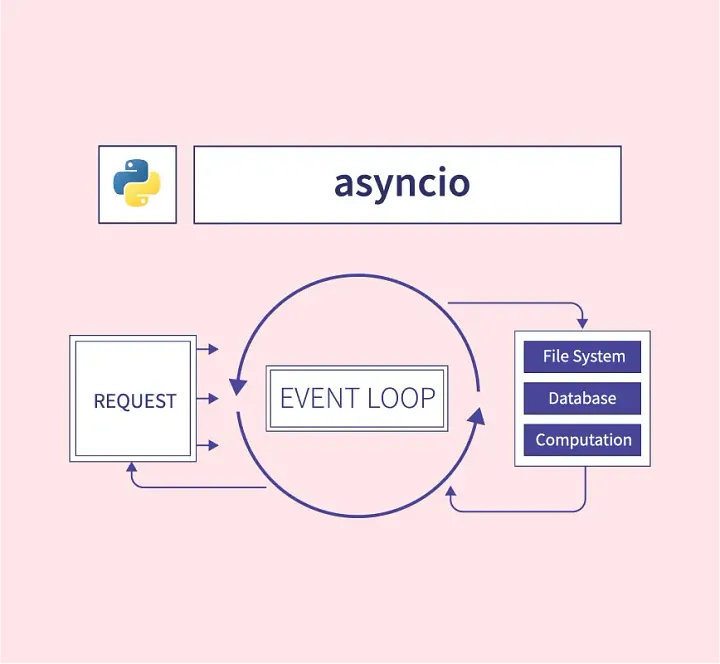
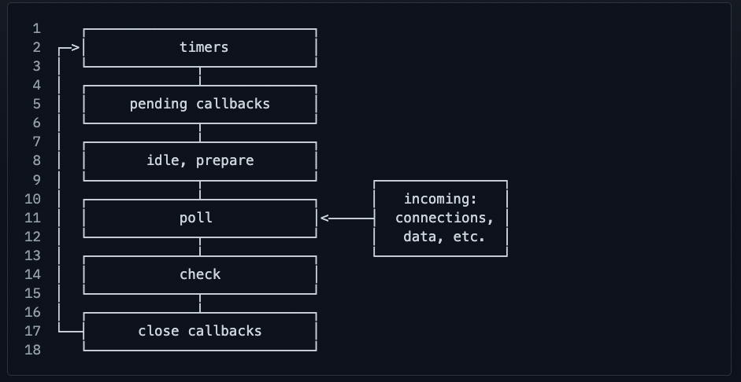

<div style="text-align: center;">
	
</div>


Starting Python web development with FastAPI naturally led me to handle Python in an asynchronous state. Until now, I only vaguely thought that to use Python asynchronously you just had to use async. With the weekend approaching, I decided to build a foundation for it.
Today, I will explore and summarize what asyncio is, why it is necessary, the differences with node.js and more.

## What is asyncio?

The official documentation introduces [asyncio](https://docs.python.org/ko/3/library/asyncio.html) as **"a library for concurrent execution using the async/await syntax"**. By using the asyncio library, you can efficiently handle IO-bound tasks, which is why it underpins high-performance web frameworks, network connections, database connections, and other libraries.

asyncio is a library in Python that supports asynchronous I/O, enabling you to write concurrent code using the async/await syntax—in other words, it is a built-in tool for implementing concurrency in Python.

Although using asyncio makes it appear as if multiple tasks are executed simultaneously, in reality, they are executed **asynchronously within a single thread**. This asynchronous programming is mainly suited for IO-bound tasks (such as file reading/writing, network request handling, or DB queries). By using asyncio, while one task is waiting on I/O, another task can run, thereby increasing efficiency. The official documentation even mentions that asyncio is ideally suited for IO-bound and high-level network code. On the other hand, asyncio might not be as effective for CPU-bound tasks, which will be discussed later. In summary, asyncio is a built-in **"event loop-based asynchronous I/O library"** in Python.

> By using asyncio, developers explicitly define coroutines and achieve concurrency by executing them simultaneously through an event loop. This design relies on **cooperative multitasking**, unlike traditional thread-based approaches where the OS preemptively multitasks.

Before asyncio became an official library, third-party asynchronous libraries like [Twisted](https://twisted.org/) and [Gevent](https://www.gevent.org/) were used.

---

### The Background Behind asyncio's Emergence in Python

The emergence of asyncio in Python was driven by **the language's own execution model and I/O bottlenecks**, as well as the **limitations of the existing thread model**. Traditionally, Python provided multi-threading and multiprocessing as the basic means of handling concurrency. However, both approaches have their pros and cons, and Python has its own inherent constraints.

#### GIL and the Single-Threaded Structure

The Python interpreter (in the CPython implementation) has a lock known as the **Global Interpreter Lock (GIL)**. Because of the GIL, only one thread can execute Python bytecode at any given time. Consequently, even when using multithreading, CPU-bound tasks do not execute concurrently—they run one at a time. In other words, for CPU-intensive tasks, adding more threads does not improve performance and may even slow things down due to context switching overhead.

> [From Python 3.13, GIL restrictions have been relaxed.](https://news.hada.io/topic?id=16978) However, this change does not significantly diminish the advantages of asyncio. Due to CPU scheduling principles, when one thread handles an I/O task, another can run, so the GIL is not a critical issue for I/O performance. Significant improvements in CPU-bound performance are anticipated in Python.

#### I/O-bound Task Bottlenecks

For I/O-bound tasks (like file or network I/O), threads are useful even under the GIL. For example, while one thread waits for a network response, it can release the GIL, allowing another thread to run. However, creating thousands of threads leads to high memory consumption and context switching costs. **Since Python threads are OS-level, creating a large number increases scheduler overhead and degrades performance.**

#### Complexity of the Thread-Based Model
<div style="text-align: center;">
	
</div>

Threads introduce complexities such as synchronization for accessing shared resources, deadlocks, and race conditions. In Python, developers must carefully manage shared data. While thread-based code delegates concurrency to the OS, it requires careful handling of shared state.

---

### The Background and Emergence of asyncio

The Python community needed a lighter concurrency model. **Event loop-based asynchronous processing** emerged as an alternative solution. While Node.js and JavaScript runtimes were already handling high concurrency efficiently, Python lacked an integrated solution. Thus, asyncio was introduced in **Python 3.4 (around 2014)**.

It started with Guido van Rossum’s Tulip project ([PEP 3156](https://peps.python.org/pep-3156/)), was standardized, and with Python 3.5 added async/await support ([PEP 492](https://peps.python.org/pep-0492/)), async programming became more convenient. With `asyncio.run()` in Python 3.7, running the event loop became even simpler.

---

### Differences Between Python’s asyncio and Threads

Before Tulip, Python handled concurrency using **threads**. While asyncio’s **coroutine-based concurrency** may appear similar, there are differences in internal operation and performance.

#### Implementing Concurrency

- **Thread**: Uses multiple OS threads within a single process for **preemptive multitasking**. Due to the GIL, only one thread runs at a time, though threads waiting for I/O can let others run.
- **asyncio (Coroutine)**: Uses an **event loop** to cooperatively schedule multiple coroutines within a single thread. The `await` keyword yields control, enabling **cooperative multitasking**.

#### Performance and Resource Usage
<div style="text-align: center;">
	
</div>

- **Thread Performance**: Threads are useful for I/O-bound tasks, but many threads increase memory and context switching overhead.
- **asyncio Performance**: Achieves high concurrency with low memory overhead since it does not create OS threads.

> If a coroutine runs too long without yielding via `await`, no other coroutine can run, effectively halting the event loop.

---

### Code Examples

#### Thread-Based Example

```python
import threading
import requests

urls = [ ... list ... ]
results = []

def download(url):
    resp = requests.get(url)        # Blocking network I/O
    results.append(resp.text)

threads = []
for url in urls:
    t = threading.Thread(target=download, args=(url,))
    t.start()
    threads.append(t)
for t in threads:
    t.join()  # Wait for all threads to complete
print(len(results), "responses received")
```

#### asyncio-Based Example
```python
import asyncio
import aiohttp

urls = [ ... list ... ]
results = []

async def download(url, session):
    async with session.get(url) as resp:   # Asynchronous HTTP GET
        text = await resp.text()          # Read response text (asynchronous I/O)
        results.append(text)

async def main():
    async with aiohttp.ClientSession() as session:
        tasks = [asyncio.create_task(download(url, session)) for url in urls]
        await asyncio.gather(*tasks)
    print(f"{len(results)} responses received")

asyncio.run(main())

```


### Comparison with Node.js
<div style="text-align: center;">
	
</div>

When discussing Python’s asyncio, a common comparison is with **Node.js**, which uses an event loop for asynchronous processing.

#### Similarities

- Both use an **event loop** to handle asynchronous tasks.
- Both are designed to run on a **single thread**.

#### Differences

- In Node.js, the event loop is always running, whereas in Python you explicitly start it (e.g., via `asyncio.run()`).
- Node.js has a history of using **callbacks**, later upgraded to **Promises** and async/await.
- Python often mixes synchronous and asynchronous code, requiring extra care (e.g., with the Django ORM).

---

## How to Use asyncio (Basic Usage Summary)

Let's review the basics—from defining a **coroutine**, executing it with **asyncio.run()**, running multiple coroutines concurrently with **asyncio.gather()**, to asynchronous loops (**async for**), asynchronous context managers (**async with**), and even using `yield` within coroutines—with example code.

### Defining a Coroutine and asyncio.run()

A **coroutine** is the core unit of async/await functionality in Python. It is defined with `async def`; when called, it does not execute immediately but returns a **coroutine object**. This object represents a **future task** to be executed. The following `hello` coroutine requires an event loop to run:

```python
import asyncio

async def hello():
	print("Hello ...")
	await asyncio.sleep(1)       # Wait asynchronously for 1 second (yield control)
	print("... World!")

# Calling the coroutine does not execute it immediately
coro = hello()
print(coro)
# <coroutine object hello at 0x...>
```

asyncio.run() is a convenience function that starts an event loop and runs the given coroutine until it completes. Typically, you call `asyncio.run(main())` to execute a main coroutine. Internally, `asyncio.run()` creates a new event loop, runs the `main()` coroutine, and cleans up the loop after completion. This is the recommended entry point in Python 3.7+.

```python
async def main():
	print("Starting work")
	await hello()            # Execute the above coroutine with await
	print("All work completed")

asyncio.run(main())         # Open the event loop and run the main coroutine
```

When you run the above code, inside `main()` the `await hello()` call enters the `hello()` coroutine; while `hello()` waits for 1 second, control returns to`main()`. The output is: "Hello ..." (printed immediately) → 1-second delay → "... World!" → "All work completed".

The key is the `await` keyword. await pauses the execution of the current coroutine (waiting for the awaited operation to complete) and then resumes it, yielding control to the event loop so that other coroutines can run.

In summary:
- `async def func(): ...` defines a coroutine.
- `await something` waits non-blockingly within a coroutine for another coroutine/task to finish.
- `asyncio.run(coro)` creates and enters an event loop to run the coroutine.

### Running Multiple Coroutines Simultaneously: asyncio.gather() and create_task()

Using `await` alone runs coroutines sequentially. To run multiple coroutines concurrently, you can use **asyncio.gather()** or **asyncio.create_task()**.

- **asyncio.create_task(coro)**: Schedules the given coroutine as a background task. It immediately starts execution and returns a Task object (a kind of Future that will eventually hold the result).
- **asyncio.gather(*coros)**: Runs multiple coroutines concurrently, waits until all are complete, and then returns their results together. Internally, it wraps each coroutine into a Task and tracks them.

Let's see an example where three tasks, each taking 1 second, are run concurrently:

```python
import asyncio
import time

async def work(id):
	print(f"Task {id} started")
	await asyncio.sleep(1)          # 1-second asynchronous task (e.g., network request)
	print(f"Task {id} completed")
	return id

async def main():
	start = time.time()
	# Method 1: Run concurrently with asyncio.gather
	results = await asyncio.gather(work(1), work(2), work(3))
	end = time.time()
	print("Concurrent execution results:", results)
	print(f"Total execution time: {end - start:.2f} seconds")

asyncio.run(main())
```
This will output something like:
```bash
Task 1 started
Task 2 started
Task 3 started
Task 1 completed
Task 2 completed
Task 3 completed
Concurrent execution results: [1, 2, 3]
Total execution time: 1.00 seconds (approximately)
```
Alternatively, you can use create_task without `asyncio.gather`:

```python
async def main():
	start = time.time()
	# Method 2: Create tasks with create_task and await them individually
	task1 = asyncio.create_task(work(1))
	task2 = asyncio.create_task(work(2))
	task3 = asyncio.create_task(work(3))
	# At this point, tasks are running in the background
	result1 = await task1
	result2 = await task2
	result3 = await task3
	end = time.time()
	print("Concurrent execution results:", [result1, result2, result3])
	print(f"Total execution time: {end - start:.2f} seconds")
```

Since tasks created with `create_task` start immediately, if you don't await them right away, other code can run concurrently. In the example above, while `task1` is running, `task2` and `task3` are created; all three run concurrently until you await their results. Essentially, `asyncio.gather` is a shorthand for this pattern.

**Error Handling**  
By default, if one of the tasks in `asyncio.gather` raises an exception, the exception is immediately propagated and the other tasks are canceled. With the `return_exceptions=True` option, exceptions are collected and returned as part of the results. Typically, you handle errors within individual coroutines or wrap the gather call in a try/except block.

**asyncio.wait**  
There is also `asyncio.wait`, which is similar to gather but returns a tuple separating completed and pending tasks. In most cases, `gather` is more convenient, and the official Python documentation recommends not using lower-level APIs directly.

### Asynchronous Iteration: async for (Asynchronous Generators)

The `async for` statement is used with asynchronous iterators/generators. While a regular for loop works by calling an iterator's `__iter__`/`__next__` methods, an asynchronous iterator provides an asynchronous `__anext__` method. The `async for` loop awaits the coroutine returned by `__anext__` on each iteration. Although this may sound complex, it is practically used in scenarios such as:

- **Reading lines asynchronously from a file or socket:**  
  For example, libraries like `aiofiles` or `asyncio.StreamReader` support async iteration, allowing you to write `async for line in reader`.
- **Streaming data with inherent waiting times:**  
  Such as consuming asynchronous events.

In addition, there are **asynchronous generators**. These are functions defined with `async def` that use the `yield` keyword to **asynchronously produce values in sequence**. Introduced in [PEP 525](https://peps.python.org/pep-0525/){:target="_blank"}, such functions return an `AsyncGenerator` object that conforms to the asynchronous iterator protocol. Asynchronous generators must be iterated over using `async for`.

Below is a simple example of an asynchronous generator and how to use `async for`:

```python
# Define an asynchronous generator function
async def async_count(stop):
    for i in range(stop):
        await asyncio.sleep(1)   # Wait asynchronously for 1 second per iteration
        yield i                 # Yield a value – async generator

async def main():
    # Use async for to receive values from the asynchronous generator
    async for num in async_count(3):
        print(f"{num} output (time: {time.time():.0f})")

asyncio.run(main())
```
You will see that each number is printed at 1-second intervals. The `async_count` function waits for 1 second in each loop (using `await asyncio.sleep(1)`) and then yields `i`. Using `yield` within an `async def` creates an Async Generator, which is different from a normal generator. Internally, the async for num in `async_count(3)` loop works as follows:

```python
iterator = async_count(3).__aiter__()
while True:
    try:
        num = await iterator.__anext__()
    except StopAsyncIteration:
        break
    # loop body
    print(num)
```
The `async for` loop abstracts away this complexity, so you only need to write the simpler syntax.

### Asynchronous Context Managers: async with
The `async with` statement is used to work with asynchronous context managers. Whereas a regular `with` statement calls an object's `__enter__` and `__exit__` methods to manage resources, in an asynchronous context it calls the asynchronous methods `__aenter__` and `__aexit__`. For example, `asyncio.Lock` is an asynchronous lock that can be acquired and released using `async with`. Similarly, resources such as `aiohttp.ClientSession` or a database's `AsyncSession` are often managed with `async with` to ensure proper opening and closing.


# References
- Python document, asyncio: https://docs.python.org/ko/3/library/asyncio.html
- Python document, coroutines and task: https://docs.python.org/3/library/asyncio-task.html#coroutine
- Python document, eventloop: https://docs.python.org/3/library/asyncio-eventloop.html
- Python Asyncio vs Threading: https://www.geeksforgeeks.org/asyncio-vs-threading-in-python/
- Async IO in Python: A Complete Walkthrough: https://www.geeksforgeeks.org/asyncio-vs-threading-in-python/